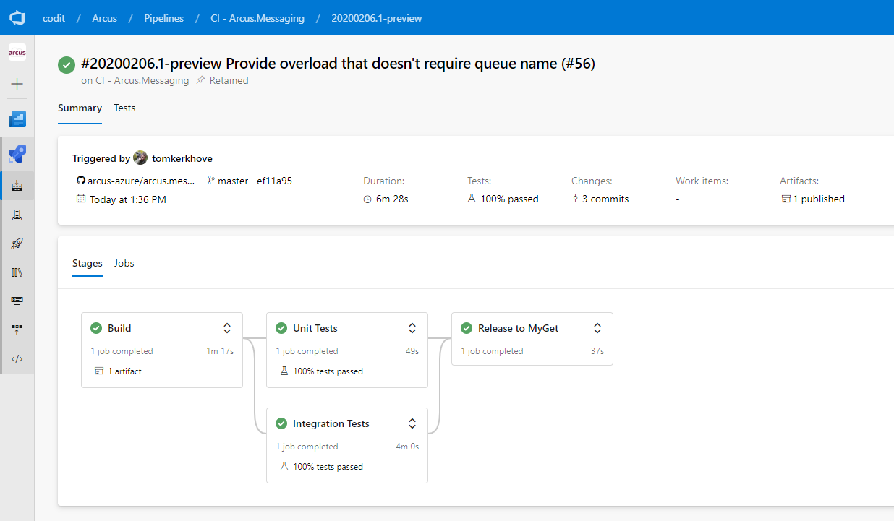

# 2019, A Year of Many Changes

In 2019 we've [announced **Arcus**](https://www.codit.eu/blog/announcing-arcus/), a set of open-source components that make it easier to build applications that run on Microsoft Azure.

Since then we've been working hard to provide more functionality, make it easier to use and even introduce new areas where we are investing in!

With Arcus we strive to reduce rewriting functionality that all our customers need so that we can focus on their business needs rather than infrastructure.

Come and take a look at what we've done on Arcus!

## Transitioning to Azure Pipelines (YAML)

When we started working on Arcus, Azure Pipelines with YAML support did not exist yet in Azure DevOps so we started off with the classic Builds & Releases.

Overtime we've noticed that it was slowing us down from delivering features:

- PRs didn't include build changes, so CI failed while it shouldn't
- Somebody with the correct permissions had to perform manual changes after a PR was merged
- Hard to provide consistent pipelines across all GitHub repos
- Pipelines are not in source control

That's why **we've decided to invest in migrating from classic Build & Releases into Azure Pipelines based on YAML**.



In every existing, new and future GitHub repositories; we use YAML as our primary build system. This was a major change across the Arcus organisation but was definately worth it!

By doing this, **managing our pipelines has become super easy**:

- New repos come with our standard pipelines out-of-the-box, thanks to our [GitHub template](https://github.com/arcus-azure/arcus.github.template)
- Re-use of pipeline components with their own lifecycle
- Changes to our pipelines can be done in the same PR
- No more manual interactions


As part of this effort, we've created a dedicated [`azure-devops-templates`](https://github.com/arcus-azure/azure-devops-templates) **GitHub repository that contains reusable [YAML templates](https://docs.microsoft.com/en-us/azure/devops/pipelines/process/templates?view=azure-devops)**. This reduces duplication, makes the structure of different parts of the build process central so we can quickly update _all_ Arcus repositories with one PR.

As an example, every project uses our [*Run Integration Tests*](https://github.com/arcus-azure/azure-devops-templates/blob/master/test/run-integration-tests.yml) template which replaces the configuration tokens for application settings, as well as the `dotnet` command to run the tests.

### What about GitHub Actions?

Good you've asked! It's fairly simple - GitHub Actions is even newer than Azure Pipelines.

Since Azure Pipelines works fine for us there is no reason why we would move over to GitHub Actions.

## Arcus Event Grid is now more flexible and supports CloudEvents natively

[Arcus Event Grid](https://github.com/arcus-azure/arcus.eventgrid) was the first area that we've invested in and already provided some basic functionality to interact with Azure Event Grid, both sending and receiving.

In 2019 we've improved it a bit so that:

- You can send **raw payloads** (without schema, just a raw JSON string)
- You can now **send single or collection of events at once**
- Use the **official Azure event type from the Azure SDK**
- Receive events in **CloudEvents** format, based on the official CloudEvents SDK

This means that you are no longer locked-in to Azure Event Grid's schema and can use whatever you want!

## Arcus Security is now improved

[Arcus Security](https://github.com/arcus-azure/arcus.security)'s focus in 2019 was mainly internal restructuring and improvements for future upcoming features.

As part of that effort we have:

- New ways to authenticate with Key Vault - Certificate-based authentication & raw connection string support for Managed Identity
- Introduced resiliency to correctly handle HTTP `TooManyRequests` errors returned from Azure Key Vault
- Integrated with .NET Core's `IConfigurationBuilder` as a configuration provider
- Introduced in-memory caching of secrets to avoid hitting service limitations
- Improved our internal testing
- Exposed secret version
- Improved usability

## Security made simpler with Arcus Web API

[Arcus Web API](https://github.com/arcus-azure/arcus.webapi) was one of our main focuses of 2019 where we wanted to start building a toolbox of features that we see on every project, mainly being security & exception handling.

Nobody likes to keep on writing the same things over and over again, that's why we've introduced our **exception handling middleware** which takes care of unhandled exceptions and returns a proper HTTP 500 to the API consumer. If we've forgotton to handle an exception, it will be managed and logged so it can be reacted upon.

Another important area was security - Every API should be secure-by-default but the problem is often that there is not enough time and/or focus spent on it.

We now provide two ways of enforcing API authentication out of the box:

- **Shared Access Key (SAS) authentication** which supports header and/or query parameter for passing the key
- **Mutual TLS (mTLS) authentication** which allows you to define the criteria

Last but not least, we've added OAuth security definitions for easily annotating OpenAPI specs.

## Get started easily with Arcus Templates

As Arcus grows over time, we have more and more components that can help you build applications. We've seen that over time it's less trivial to figure out what you can help and starting new APIs can take some time to wire things up.

With [**Arcus Templates**](https://github.com/arcus-azure/arcus.templates) this all changes - It is the home of quickstart templates so you can kickstart your new project with a breeze.

First, install the template from NuGet:

```shell
> dotnet new --install Arcus.Templates.WebApi
```

When installed, the template can be created with shortname: arcus-webapi:

```shell
> dotnet new arcus-webapi --name Arcus.Demo.WebAPI
```

Et voila, you are ready to start building your application!

As of now, **we provide the following components out-of-the-box**:

- Exception middleware to log unhandled exceptions thrown during request processing
- Content negotiation that only supports application/json
- Open API documentation generation and UI *(only available locally, unless configured otherwise)*
- A basic health endpoint with ASP.NET Core health checks & OpenAPI support
- Default console logger, with capability to opt-in for Serilog
- Dockerfile

However, if you don't like certain aspects you can still tweak the template based on your needs.

For example, we don't want to enforce authentication on your APIs but you can opt-in for Shared Access Key (SAS) or Mutual TLS (mTLS)!

## 2020, a Sneak Peak

And we are not stopping there!

Security is important and we'll keep on investing in this area. Most of our Arcus components fully rely on Arcus Security so it's an essential part of our ecosystem.

On most of our projects, we use queues to decouple processes and process the workload asynchronously. We've seen that we have to write message pumps over and over again where we have to manage the pump, provide exception handling, telemetry, deserialization and more but we are going to provide all of this out-of-the-box! This would allow you to focus on the processing of the messages and not how you get them.

More and more Azure services are starting to emit Event Grid events which allow us to automate processes. [Azure Key Vault is one of them](https://docs.microsoft.com/en-us/azure/event-grid/event-schema-key-vault) which notifies us about expiring certificates or secrets that are updated, we'll use this to automatically renew our cached secrets in a secure manner.

Last but not least, deploying your applications to production is only the beginning and not the end. That's why observability is crucial for building production-ready platforms so that the operation team understands what's going on. However, developers tend to not care about that until it's too late.

Because of that, we'll try to reduce the pain of providing good tracing, metrics, request logging, business event tracking and visual representation of the application by extending Serilog so that it works better with Azure Application Insights.

Smells like new templates coming up as well? Damn right.

And who knows what we'll add next! Do you have a great idea? Don't hesitate to let us know in the comments or on GitHub!

Thanks for reading,

Stijn & Tom.
