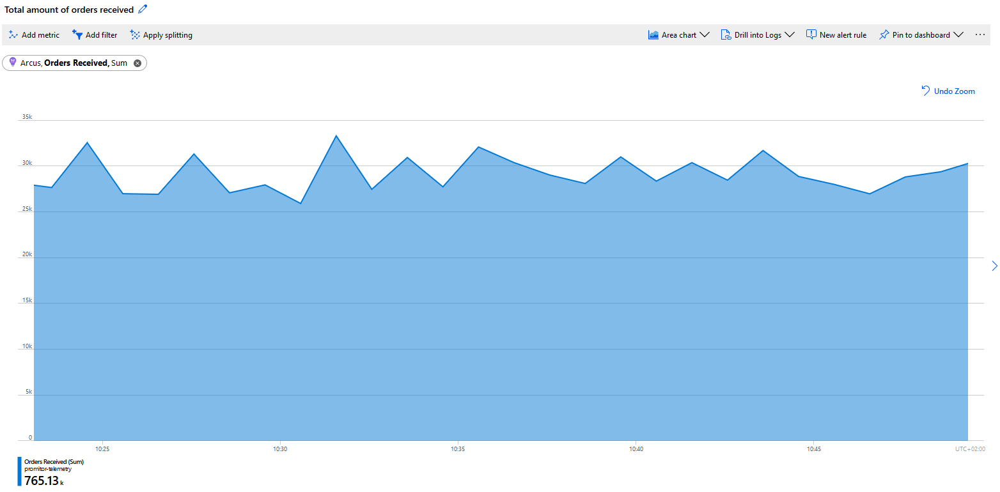
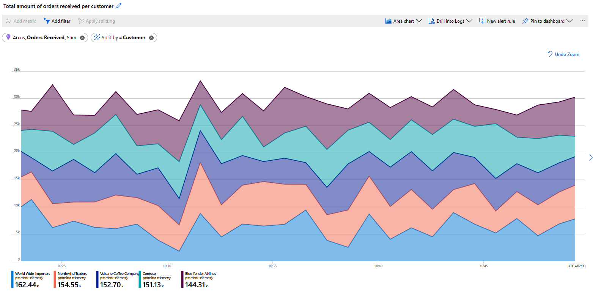
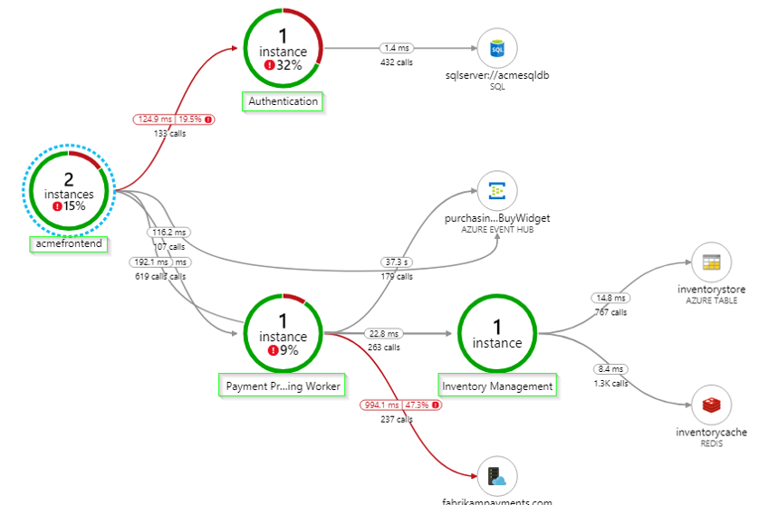
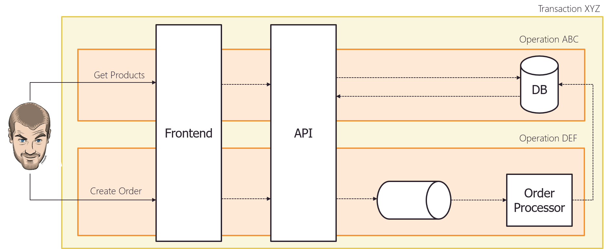
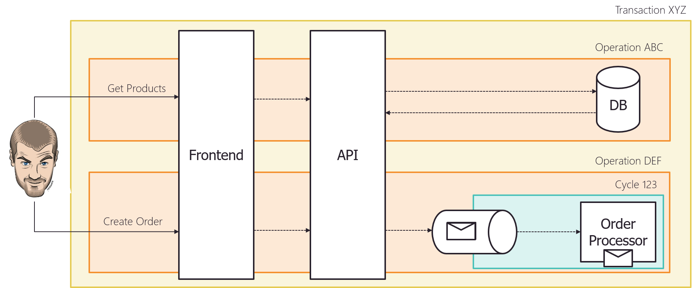

# Announcing Arcus Observability

While building applications it's important that they give enough insights on what is going on and provide enough information to diagnose in case of issues - This is not a trivial thing to do.

Over the past couple of years, we've seen more and more focus on that front and decided to bring some of that experience to Arcus as we believe everybody benefits from it!

We are happy to announce that we are **introducing Arcus Observability allowing you to empower your applications with a variety of essential features to run operable platforms**!

- **Go beyond traces, use most suited telemetry types!**
- **Correlate your telemetry out-of-the-box**
- **Empower your telemetry** with automatic enrichment and contextual information
- **Support for structured logging**

## Extend instead of reinvent

There are a variety of libraries out in the wild which try to fix one or more of the goals we have but we've decided not to go that route and heavily invest in extending what is in the community already!

That's why we've decided to:

- Make Microsoft logging functionality more powerful by extending `ILogger`
- Build on top of Serilog, a powerful framework that allows you to write telemetry once and flow it to a variety of sinks

While we mainly use application insights and plain logs (containers 👋) on our projects, we want to be open for any platform and that's why we believe Serilog is the best fit!

We even took it a step further by not only building on top of Serilog but also extending [Serilogs Application Insight sink](https://github.com/serilog/serilog-sinks-applicationinsights) to support all telemetry types.

Once our library is more stable we will collaborate with the owners to see if we can contribute some of it more upstream.

Take a look at what it has to offer!

## Writing Different Types of Telemetry

Our [Arcus.Observability.Telemetry.Core](https://www.nuget.org/packages/Arcus.Observability.Telemetry.Core/) package provides a whole bunch of extensions on the `ILogger` type that makes it a piece of cake to write a variety of telemetry types that fit your needs!

By using Arcus Observability; you can write custom events, requests, dependencies, and (multi-dimensional) metrics in your applications and we'll nicely output them with [structured logging](https://github.com/serilog/serilog/wiki/Structured-Data)!

You can very easily write a custom/business event as following:

```csharp
logger.LogEvent("Order Created");
// Log output: "Events Order Created (Context: )"
```

For more examples about the other types, have a look [at our documentation](https://observability.arcus-azure.net/features/writing-different-telemetry-types).

### Making it easier to provide contextual information

Providing context around your telemetry is super powerful! You do not only provide information about what happened but give more information about the why.

Let's use an example - When measuring a metric you get an understanding of the count, in our case the number of orders received:

```csharp
logger.LogMetric("Orders Received", 133);
// Log output: "Metric Orders Received: 133 (Context: )"
```

If we output this to Azure Application Insights as a metric similar to our example:



However, you can very easily provide additional context, allowing you to get an understanding of the number of orders received and annotate it with the vendor information.

```csharp
var telemetryContext = new Dictionary<string, object>
{
    { "Customer", "Contoso"},
};

logger.LogMetric("Orders Received", 133, telemetryContext);
// Log output: "Metric Orders Received: 133 (Context: [Customer, Contoso])"
```

The outputted telemetry will contain that information and depending on the sink that you are using it's even going to be more powerful.

For example, when using Azure Application Insights your metric will evolve from a single-dimensional metric to multi-dimensional metrics allowing you to get the total number of orders, get the number of orders per vendor or filter the metric to one specific vendor.

Here we are using our multi-dimensional metric and splitting it per customer to get more detailed insights:



### Making it easier to measure dependencies

For dependency telemetry, we provide an easy way to measure the duration of actions by using `DependencyMeasurement`.

You can simply start a new measurement and pass that information to our extension:

```csharp
// Create request
var request = new HttpRequestMessage(HttpMethod.Post, "http://requestbin.net/r/ujxglouj")
{
    Content = new StringContent("{\"message\":\"Hello World!\"")
};

// Start measuring
using (var measurement = DependencyMeasurement.Start())
{
    // Send request to dependant service
    var response = await httpClient.SendAsync(request);

    _logger.LogHttpDependency(request, response.StatusCode, measurement);
    // Output: "HTTP Dependency requestbin.net for POST /r/ujxglouj completed with 200 in 00:00:00.2521801 at 03/23/2020 09:56:31 +00:00 (Successful: True - Context: )"
}
```

By measuring your dependencies you will gain insights on what is going on and be able to pinpoint issues over time. Depending on the telemetry sink that you are using this will even become more powerful!

When using Azure Application Insights, it will automatically start drawing your **Application Map giving you insights of the general performance of all your components**. Every circle represents a ["Component"](https://docs.microsoft.com/en-us/azure/azure-monitor/app/app-map?tabs=net#what-is-a-component) and if you use our *Application enricher* we will use the name for them that you provide. *(more later)*


*Source: ["Application Map: Triage Distributed Applications"](https://docs.microsoft.com/en-us/azure/azure-monitor/app/app-map)*

As you provide more dependency information for all your components you'll start to **build living documentation of your Azure landscape** of how every piece works together:


*Source: ["Application Map: Triage Distributed Applications"](https://docs.microsoft.com/en-us/azure/azure-monitor/app/app-map)*

We've seen that, when done right, Application Map is super powerful and an essential tool in your operational toolbelt to monitor but also more easily onboard new people as they'll easily grasp how all components work together.

## A Conventional Way to Correlate

With our [Arcus.Observability.Correlation](https://www.nuget.org/packages/Arcus.Observability.Correlation/) package we provide a convenient way to correlate all telemetry in your applications.

It provides a minimal model called `CorrelationInfo` which uses correlation on two levels:

- **Transaction Id** - ID that relates different requests together into a functional transaction.
- **Operation Id** - Unique ID information for a single request.

Here is what it looks like in an example:



The correlation info can be accessed throughout the application via an `ICorrelationInfoAccessor` implementation. We are using this under the hood for our correlation Serilog enricher which automatically adds this information to your telemetry as well!

### Laying the foundation for other components and apps

The purpose of our correlation is to provide a basic setup in the most general way but what it doesn't include is how this correlation is initially retrieved because this is application-specific. It's up to the consumer to call the `ICorrelationInfoAccessor.SetCorrelation` at the right moment.

For example, in [Arcus Web API we use a `HttpCorrelationInfoAccessor` under the hood](https://webapi.arcus-azure.net/features/correlation) that uses the HTTP request features to access this correlation information for each incoming HTTP request. This will then be used to automatically correlate all telemetry in the application back to the individual request that was made.

While in Arcus Messaging we will even take it a step further and provide a 3rd level of correlation - Message Processing Cycle Id. This is a unique identifier that will be assigned to every attempt when processing an inbound message.



This allows you to scope the telemetry to just a given processing attempt, which helps you troubleshoot poison messages or transient issues.

For more information on how the correlation in this library can be configured and how customization can be done, see the [docs](https://observability.arcus-azure.net/features/correlation).

## Boosted Serilog Functionality

To improve writing telemetry information via Serilog, we have added some extra functionality!

Let's have a closer look.

### Enrichment

The [Arcus.Observability.Telemetry.Serilog.Enrichers](https://www.nuget.org/packages/Arcus.Observability.Telemetry.Serilog.Enrichers/) package provides several [Serilog Enrichers](https://github.com/serilog/serilog/wiki/Enrichment) to automatically add information to your telemetry:

- **[Application enricher](https://observability.arcus-azure.net/features/telemetry-enrichment#application-enricher)** adds a `ComponentName` to the logs which can be used for dependency tracking in Application Insights.
- **[Correlation enricher](https://observability.arcus-azure.net/features/telemetry-enrichment#correlation-enricher)** adds the correlation information based on `ICorrelationInfoAccessor`.
- **[Kubernetes enricher](https://observability.arcus-azure.net/features/telemetry-enrichment#kubernetes-enricher)** adds machine information of the environment related to Kubernetes.
- **[Version enricher](https://observability.arcus-azure.net/features/telemetry-enrichment#version-enricher)** adds the current runtime assembly version of the product.

By using these, you don't have to specify them every time you write telemetry; we've got this!

For more information, see [docs](https://observability.arcus-azure.net/features/telemetry-enrichment).

### Sinking to Application Insights

As mentioned before, we decided to extend the official [Azure Application Insights sink](https://github.com/serilog/serilog-sinks-applicationinsights) with a lot more functionality!

Our Serilog sink is available in [Arcus.Observability.Telemetry.Serilog.Sinks.ApplicationInsights](https://www.nuget.org/packages/Arcus.Observability.Telemetry.Serilog.Sinks.ApplicationInsights/) package and provides even better integration with Azure Application Insights on top of the official one:
- When using our new `ILogger` extensions, we will **report telemetry using Application Insights native telemetry types** (events, metrics, requests, dependencies)
    - Traces were already supported out-of-the-box
- **Correlation information is automatically annotated** on Application Insights telemetry to be fully optimized
- **Automatically provide cloud context** by assigning role name & instance information to provide better integration with application map
    - For this to work properly, we highly suggest using our application enricher as this is based on `ComponentName` information

Following example shows how this sink can be configured in your Serilog setup:

```csharp
ILogger logger = new LoggerConfiguration()
    .MinimumLevel.Debug()
    .WriteTo.AzureApplicationInsights("<key>")
    .CreateLogger();
```

For more information, see [docs](https://observability.arcus-azure.net/features/sinks/azure-application-insights).

### Filtering

When writing to a lot of telemetry, some telemetry types can be filtered-out using the available Serilog filter.

This allows you to use the different flavors of telemetry types according to your needs and use filters to reduce the information stream to your sinks based on configuration.

You can get started by using our [Arcus.Observability.Telemetry.Serilog.Filters](https://www.nuget.org/packages/Arcus.Observability.Telemetry.Serilog.Filters/) package.

The following example shows how telemetry events can be filtered out:

```csharp
ILogger logger = new LoggerConfiguration()
    .WriteTo.AzureApplicationInsights("<key>")
    .WriteTo.Console()
    .Filter.With(TelemetryTypeFilter.On(TelemetryType.Events))
    .CreateLogger();
```

You can use this for all Serilog telemetry sinks, not just Azure Application Insights. For more information, see [docs](https://observability.arcus-azure.net/features/telemetry-filter).

## Roadmap

While we have introduced a lot of powerful features in this first release, we have a lot of ideas on making it even more powerful!

We want to:
- **Provide more dependency types out-of-the-box**, making it easier for you to provide the data and we'll make sure it's optimized for systems such as Azure Application Insights ([list of upcoming types](https://github.com/arcus-azure/arcus.observability/issues?q=is%3Aissue+is%3Aopen+sort%3Aupdated-desc+label%3Adependencies))
- **Provide native support for cross-component correlation** allowing you to have more powerful information and optimized Azure Application Insights App Map.
- **Integrating observability in all Arcus components** such as Web API, Messaging, Templates, Background Jobs, etc.
- **Improve our documentation**

What do you like to see in Arcus Observability? Let us know [on GitHub](https://github.com/arcus-azure/arcus.observability/issues/new?template=Feature_request.md)!

Thanks for reading,

Stijn & Tom
