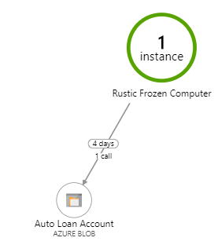

# Measure a variety of Azure dependencies with Observability v0.2

With the release of the next version of [Arcus Observability v0.2](https://github.com/arcus-azure/arcus.observability/releases/tag/v0.2.0) the support for dependency tracking of Azure resources is greatly expanded.

Come see what this new version has to offer!
For more information, see the [offical docs](https://observability.arcus-azure.net/).

## Azure IoT Hub dependency tracking

We allow you to measure Azure IoT Hub dependencies using the `LogIotHubDependency` overload.
Tracking this dependency, shows on the application map:


## Azure Blob storage dependency tracking

We allow you to measure Azure Blob storage dependencies using the `LogBlobStorageDependency` overload.
Tracking this depedency, shows on the application map:



## Azure Cosmos Db dependency tracking

We allow you to measure Cosmos Db dependencies using the `LogCosmosDdbDependency` overload.
Tracking this dependency, shows on the application map:


## Azure Event Hubs dependency tracking

We allow you to measure Event Hubs dependencies using the `LogEventHubsDependency` overload.
Tracking this dependency, shows on the application map:


## Azure Table storagedependency tracking

We allow you to measure Table storage dependencies using the `LogTableStorageDependency` overload.
Tracking this dependency, shows on the application map:


## SQL dependency tracking

Tracking SQL dependencies was already available starting from [version v0.1](https://github.com/arcus-azure/arcus.observability/releases/tag/v0.1.0), but this version also provides an additional feature to make tracking these kind of dependencies more consumer friendly.

Instead of providing the server, database, ... separatly, this version allows you to pass along the SQL connection string and extract the required information from it.

```csharp
string connectionString = "Server=sample-server;Database=sample-database;User=admin;Password=123";
using (var measurement = DependencyMeasurement.Start())
{
    // Interact with database
    var products = await _repository.GetProducts();

    _logger.LogSqlDependency(connectionString, "my-table", "get-products", isSuccessful: true, measurement: measurement);
    // Output: "SQL Dependency sample-server for sample-database/my-table for operation get-products in 00:00:01.2396312 at 03/23/2020 09:32:02 +00:00 (Successful: True - Context: )"
}
```
