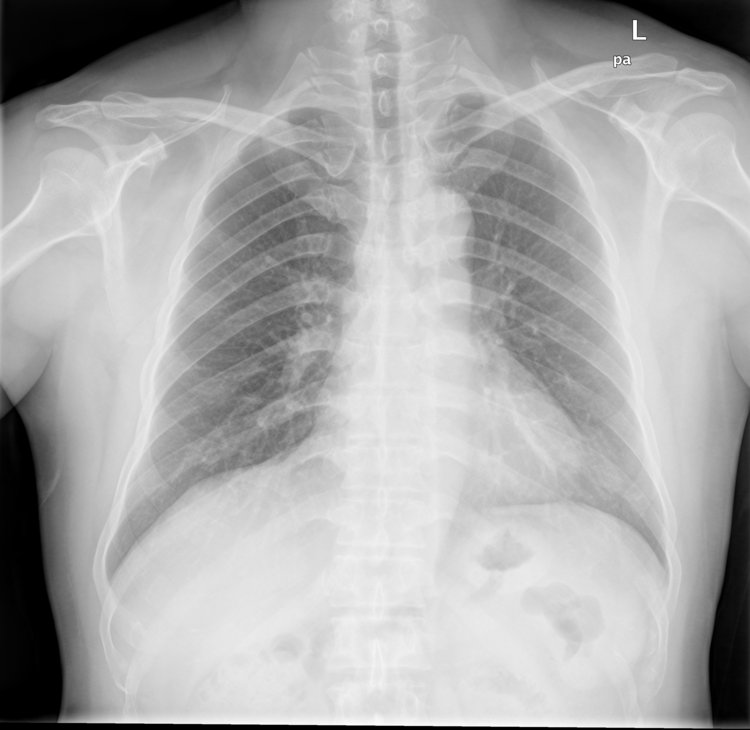

# Property-based testing the Arcus Python implementations for streamlined ML development
Arcus.ML contains several easy-to-use Python implementations for more fluent ML development. This post will guide through the process of testing these implementations with a technique to ensure robust outcomes: property-based testing.

## Why property-based testing is the right choice
The Python implementations in the [Arcus.ML](https://machine-learning.arcus-azure.net/) repository are very generic and are meant to be used in a wide range of different scenario's. Because of this, we need to test this thoroughly. Adding some static example-based tests that verify if some static input results in an expected static outcome is not enough. At Arcus, we try to make sure that every developer of any level can access the codebase. Both junior and senior people should be able to work with it. That's why it would be a very wrong move to remove all the example-based tests from the project.

Tests should be the first place where people look for the purpose and workings of the implementation. This should therefore be an even more comfortable place than the actual production code.

[Hypothesis](https://hypothesis.readthedocs.io/en/latest/) is the testing framework we use here. Like most property-based testing frameworks it has composite generators and combinators. This is especially useful in our scenario, where we need to generate a broad range of inputs. Machine Learning is also about decisions that are made on a gigantic pile of data. Just like in the actual building of the model, where you wouldn't know a single dataset by heart, will the tests make sure that we cover all our bases so it can be used in those performance-intensive scenario's. 

## Image conversions for easier pattern detection
The [Arcus.ML](https://machine-learning.arcus-azure.net/) repository contains a set of functions to manipulate images. Transforming images is especially useful to prepare a raw set of images as a clear ML dataset. One of the functions is used to transform an image to a black/white variant. Without the distraction of color, it can more easily used in a pattern detection system. This function takes in a series of images as [numpy](https://numpy.org/doc/stable/user/absolute_beginners.html) arrays and returns them back transformed.

The example-based test will use a static list of images of lungs and convert them to a black/white variant of the lungs. See following example of the result:



The test itself is rather straightforward: load the images, transform them, verify the outcome. The images are represented here as an 3D-array (matrix of pixels) and ranges from 0 to 255 to have all the available RGB colors. Our function should transform this 3D-array to only zero (0) or one (1) values, representing either black or white. The `all_black_and_white` assertion function here will do that.

```python
import arcus.ml.images.io as ami
import arcus.ml.images.conversion as conv

image_path = 'tests/resources/images/lungs'

def test_black_white_conversion_example():
    image_list = ami.load_images(image_path)
    image_converted = conv.to_blackwhite(image_list)
    assert all_black_and_white(image_converted)
```

Before we can write our properties for our black/white function, we first need to generate our random images. Above, we saw that these images are nothing more than 3D [numpy](https://numpy.org/doc/stable/user/absolute_beginners.html) arrays. Fortunately, [Hypothesis has a way of expressing custom generators](https://hypothesis.readthedocs.io/en/latest/data.html#composite-strategies):

```python
import numpy as np
from hypothesis import strategies as st

@st.composite
def images(draw, dimension = 3):
    def create_array_rec(strategy, lengths, index = 0):
        if index == len(lengths):
            return strategy
        length = lengths[index]
        arr = st.lists(strategy, min_size=length, max_size=length).map(lambda x : np.array(x))
        return create_array_rec(arr, lengths, index + 1)

    num = st.integers(min_value=0, max_value=255)
    amount = st.integers(min_value=1, max_value=10)
    return draw(st.lists(amount, min_size=dimension, max_size=dimension).flatmap(lambda lengths : create_array_rec(num, lengths)))
```

Without going too deep into the actual implementation, this function will register for us a generator that can generate 3D [numpy](https://numpy.org/doc/stable/user/absolute_beginners.html) arrays where each cell contains a `float` value between 0 to 255. Exactly what our example images in the previous static example-based test represented. It's also worth mentioning that this implementation is a temporary result of a continuing process of improving the tests.

That was the hardest part. Once you got your generator all set up, you can integrate it in your property test. Note that the default property here is even shorter than the initial static example-based test. The same assertion can also be reused here, proving a correct implementation of our black/white function.

```python
from hypothesis import given
import arcus.ml.images.conversion as conv

@given(images())
def test_black_white_property(image_list):
    image_converted = conv.to_blackwhite(image_list)
    assert all_black_and_white(image_converted)
```

## Customizable time windows for more accurate predication
A big portion of the Arcus.ML library is about manipulating time series: combining, slicing, time references... For this post we'll be looking at the windows function which will provide us with a 'windowed' version of an incoming time series. Looking at time series in windows helps greatly in a more accurate prediction at a given point with the recent past. Put simply, windows are nothing more than a set of smaller versions of the initial data set, each starting from a different place and overlapping with each other. Time series are expressed here as [pandas](https://pandas.pydata.org/docs/getting_started/index.html#getting-started) data frames and will output the windows as [numpy](https://numpy.org/doc/stable/user/absolute_beginners.html) arrays. 

The tests uses a static example of sensor values. This is a simplified set of that same data set:
```
engine_id,  cycle,  setting1,   setting2,   sensor1,    sensor2,    sensor3,    ttf
1,          1,      -0.0007,    -0.0004,    100.0,      518.67,     641.82,     191
1,          2,      0.0019,     -0.0003,    100.0,      518.67,     642.15,     190
etc...
```

The result of a windowed version of this data set, could be the following. Here we use a window length of 3 rows.
```
engine_id,  cycle,  setting1,   setting2,   sensor1,    sensor2,    sensor3,    ttf
1,          1,      -0.0007,    -0.0004,    100.0,      518.67,     641.82,     191
1,          2,      0.0019,     -0.0003,    100.0,      518.67,     642.15,     190
1,          3,      -0.0043,    0.0003,     100.0,      518.67,     642.35,     189

1,          2,      0.0019,     -0.0003,    100.0,      518.67,     642.15,     190
1,          3,      -0.0043,    0.0003,     100.0,      518.67,     642.35,     189
1,          4,      0.0007,     0.0,        100.0,      518.67,     642.35,     188

1,          3,      -0.0043,    0.0003,     100.0,      518.67,     642.35,     189
1,          4,      0.0007,     0.0,        100.0,      518.67,     642.35,     188
etc...
```

The static example-based test loads this dataset and verifies that indeed the result is 'windowed'. The `assert_all_windows_equals` will generate the expected windows directly as a list of [numpy](https://numpy.org/doc/stable/user/absolute_beginners.html) arrays and will do an equals assertion check for every expected window. This will make sure that we are absolutely sure that all values of all windows are correct. In the example we can also verify the shape of the input but as you can see there're some hardcoded values that we hope to eliminate with properties.

```python
import pandas as pd 
import arcus.ml.timeseries.timeops as tops

def test_time_windows_default_example():
    # Arrange
    df = pd.read_csv('tests/resources/datasets/engine-sensors.csv') 
    win_size = 6
    # Act
    windows, _ = tops.get_windows(df, win_size)
    # Assert
    col_size = len(df.columns)
    assert windows.shape == (15, win_size, col_size)
    assert_all_windows_equals(df, windows, win_size)
```

Generating a table of sensor data as data frames is not so hard as one might think. Hypothesis already provides a way to [generate data frames](https://hypothesis.readthedocs.io/en/latest/numpy.html?highlight=dataframe#hypothesis.extra.pandas.data_frames) for us. All we have to do is provide it with some reasonable size and types. In our first version, we used a subset of our initial sensor data columns and allowed Hypothesis to generate for us any non-Nan float number.

```python
from hypothesis import strategies as st, assume
from hypothesis.extra.pandas import data_frames, columns

@st.composite
def tables(draw):
    colls_length = draw(st.integers(min_value=1, max_value=10))
    colls_names = ["engine_id", "cycle", "setting1", "setting2", "sensor4", "seonsor4", "sensor10"]
    colls = draw(st.lists(st.sampled_from(colls_names), min_size=colls_length, max_size=colls_length))
    df = draw(data_frames(columns=columns(colls_names, dtype=float, elements=st.floats(allow_nan=False))))
    assume(len(df) > 1)
    return df
```

Different from the image conversions, we need an extra variable with our data set: the window size. As with property-based testing we can't know beforehand the size or format of the input, we should also generate this window size value. We chose to place this generation in the test itself to increase understanding of the relationship between the generated input data frame and the window size that needs to be within the bounds of that data frame. Hypothesis allows us to pass in a general [data generator](https://hypothesis.readthedocs.io/en/latest/data.html#drawing-interactively-in-tests) which we can use to generate types at test-time.

```python
from hypothesis import given, strategies as st
import arcus.ml.timeseries.timeops as tops

def get_random_window_size_within(df, data):
    return data.draw(st.integers(min_value=1, max_value=len(df)))

@given(tables(), st.data())
def test_time_windows_default_property(df, data):
    win_size = get_random_window_size_within(df, data)
    windows, _ = tops.get_windows(df, win_size)
    assert_all_windows_equals(df, windows, win_size)
```

Same as with the image conversions, we use the same assertion here to verify that the same result is to be expected: a windowed version of our generated sensor input.

## Conclusion
This post explored the possibilities of property-based testing within the realms of machine learning. Same as with property-based testing is that machine learning also acts on a higher level. It doesn't deal with specific values or examples but expresses its functionality in a broader, more general way. This separate way of working allows us to deal with the functional implementation of our application. Machine learning will make predictions on a broad set of data, property-based testing will make sure that this data is handled correctly by our model.

The way I see it, this leads to many promising adventures.
Thanks for reading!
Stijn