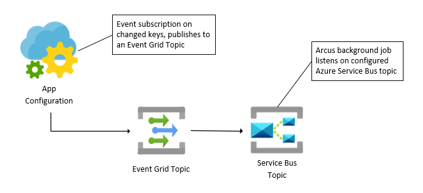

# New Azure background jobs and Managed Identity support in Arcus.BackgroundJobs v0.4
Arcus.BackgroundJobs v0.4 is packed with lots of fresh new features and added support. Come take a look at what is included in this new release!

## Notify upon potential expired Azure client secrets
This new background job rose from a typical problem when working with applications within Active Directory. There is no built-in support for getting notified when a client secret is expired or is about to expire. Unlike Azure Key Vault, there is no way of hooking upon an event and running arbitrary code that could potentially rotate the client secret. The consequence of this 'missing link' is that applications will report authentication failures when the client secret is expired. At this point, it is already too late as the administrator of the application will have to figure out what client secret needs rotating and do the key rotation. All the while, the application is offline.

Arcus' new background job provides a solution to this problem. The job runs at a specified interval and will notify the application team with Azure EventGrid events when a client secret is expired or is about to expire. This will help manage the application and Azure resources with less potential downtime.

The job is available in the new library called: `Arcus.BackgroundJobs.AzureActiveDirectory`.

```csharp
using Arcus.EventGrid.Publishing;
using Arcus.EventGrid.Publishing.Interfaces;
using Microsoft.Extensions.DependencyInjection;

public class Program
{
    public void ConfigureServices(IServiceCollection services)
    {
        services.AddSingleton<IEventGridPublisher>(serviceProvider =>
        {
            IEventGridPublisher publisher =
                EventGridPublisherBuilder
                    .ForTopic("<topic-endpoint>")
                    .UsingAuthenticationKey("<key>")
                    .Build();

            return publisher;
        });
    
        services.AddClientSecretExpirationJob();
    }
}
```

Note that the background job needs an [Azure EventGrid publisher](https://eventgrid.arcus-azure.net/Features/publishing-events) to publish any potential expired client secret events.
The job can also be configured with many options like controlling the job's interval and the content of the notified event. For more information on this background job, see [our official documentation](https://background-jobs.arcus-azure.net/).

## Refresh value upon Azure App Configuration changes
When configuration values are placed externally, like inside an Azure App Configuration instance, there is no way to know the exact time when a value is changed remotely from your local application code. The App Configuration extensions on the application configuration contain 'refreshers' that all allow you to refresh the configuration values at any given time, but without any indicator, one cannot know when the 'refresher' should be called.

Arcus BackgroundJobs v0.4 has a way to bridge this missing link by running a job that listens to any App Configuration change events and calls the refresher instance for you. This way, the circle is complete and will any remote changes automatically result in local changes in your application. The published events go via Azure EventGrid and should eventually be placed on an Azure ServiceBus topic, this setup is required on your Azure resource group as the background job needs an event source to peak from.

This overview gives you an idea of this workflow:


The job is available in the new library called: `Arcus.BackgroundJobs.AppConfiguration`. Note that this job requires the [Arcus secret store](https://security.arcus-azure.net/features/secret-store/) to interact with the Azure App Configuration and a registered App Configuration configuration source within your application configuration registration so a specific value can be updated.

```csharp
using Microsoft.Extensions.DependencyInjection;

public class Program
{
    public static IHostBuilder CreateHostBuilder()
    {
        return Host.CreateDefaultBuilder()
                   .ConfigureSecretStore(...)
                   .ConfigureAppConfiguration(builder =>
                   {
                       builder.AddAppConfiguration(options =>
                       {
                           options.Connect("<connection-string>")
                                  .Register("<configuration-key>");
                       });
                   })
                   .ConfigureServices(services =>
                   {
                       services.AddAutoRefreshAppConfigurationBackgroundJob(
                            //    this allows the background jobs to support applications that are running multiple instances, processing the same type of events, without conflicting subscription names.
                            subscriptionPrefix: "TestSub",
                            // Connection string secret key to a Azure Service Bus Topic.
                            serviceBusTopicConnectionStringSecretKey: "MySecretKeyToServiceBusTopicConnectionString");
                       );
                   });
    }
}
```

For more information on this background job, see [our official documentation](https://background-jobs.arcus-azure.net/Features/AzureAppConfiguration/auto-refresh-app-configuration).

## Managed Identity support for CloudEvents background jobs
We are very happy to announce that the v0.4 release of BackgroundJobs also includes a valuable contribution that solves a missing functionality problem in the background jobs environment. This library heavily builds on top of our Arcus Messaging library. The Messaging library received a feature some releases ago that allowed Managed Identity authentication when registering message pumps. As Managed Identity is the way to go from a security perspective, this could not be missing in our BackgroundJobs library.

Luckily, one of our contributors saw this and made a proposal. When registering CloudEvents background jobs you can now use Managed Identity authentication instead of passing secret keys that point to connection strings within the Arcus secret store. It is a simple and small change, but it has a huge impact. Another reason why contributions are so important.

## .NET 6 support
This release also finally supports .NET 6 which means that from now on all Arcus library components are .NET 6 supported. We made sure that we still support .NET Core 3.1 until the end of the year; when .NET Core will also be deprecated by Microsoft. Until then, we provide multi-framework support on our components.

## Conclusion
The BackgroundJobs library is one of the fundamental reasons why Arcus exists. It provides real useful bridges between existing Azure functionality and makes your applications more reactive. Repeated tasks and 'polling' work are not needed anymore. Arcus provides the tools so you can focus solely on the application code. 

Take a look our [documentation site](https://background-jobs.arcus-azure.net/) to see what this library all contains.
If you have any questions, remarks, comments, or just want to discuss something with us; feel free to [contact the Arcus team at Codit](https://github.com/arcus-azure/arcus.webapi/issues/new/choose).

- Arcus team