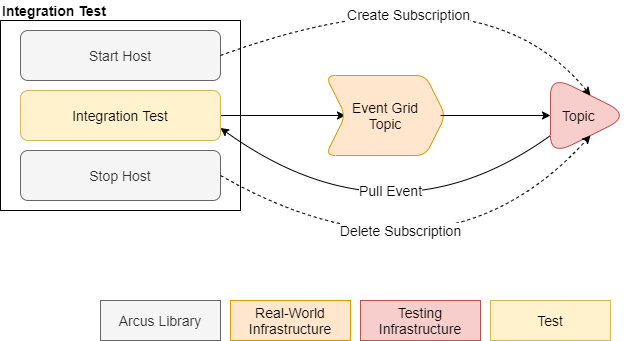

# The long overdue Arcus EventGrid v3.2 release
Version v3.2 of the Arcus EventGrid library was released recently, almost two years after v3.1. Here's a long overdue quick run-down of the new features and changes in this release.

## EventGrid authorization with Arcus secret store
We provide support for endpoint validation, when implementing your own custom web hook. This validation allows to secure your web hook with a secret key (taken from the query string or an HTTP header).  
This is needed, because Azure EventGrid sends a validation request to a newly configured web hook, in order to prevent people leveraging Azure EventGrid to bring down a 3rd party API. 

Authorization with Azure EventGrid was previously done with an attribute where the secret was managed internally. This approach was more a 'proof of concept' than a production-ready implementation. The new version uses the [Arcus secret store](https://security.arcus-azure.net/features/secret-store/) as a way of handling secrets and can be assigned globally on the entire Web application or locally on specific operations.

Configuring the authorization globally is as easily done as our Web API security filters. The following example shows how the `x-api-key` HTTP header will be used to look for the secret value. This value should be the same value as the one retrieved from the Arcus secret store with the name `MySecret`. 
```csharp
using Arcus.EventGrid.WebApi.Security;
using Microsoft.Extensions.DependencyInjection;

public class Program
{
    public void ConfigureServices(IServiceCollection services)
    {
        services.AddMvc(options => options.Filters.AddEventGridAuthorization(HttpRequestProperty.Header, "x-api-key", "MySecret")));
    }
}
```

Enforcing authorization on operation level is done via a dedicated attribute:
```csharp
using Arcus.EventGrid.WebApi.Security;
using Microsoft.AspNetCore.Mvc;

[Route("events")]
[ApiController]
public class EventController : ControllerBase
{
    [EventGridAuthorization(HttpRequestProperty.Header, "x-api-key", "MySecret")]
    public IHttpActionResult Get()
    {
        return Ok();
    }
}
```

For more information on endpoint authorization, see our [official documentation page](https://eventgrid.arcus-azure.net/Features/endpoint-validation).

## Event subscription validation with CloudEvents support
Starting from v3.2, we also support CloudEvents when validating incoming events. Previously, we only validated EventGrid events. The full explanation of how to receive and validate events is fully described in [these Microsoft docs](https://docs.microsoft.com/en-us/azure/event-grid/receive-events). The short version is that in case of EventGrid events, the `Aeg-Event-Type` HTTP header and that the request body contains a `SubscriptionValidation` event model. In case of CloudEvents, a `OPTIONS` HTTP method should be used and validation happens on the `WebHook-Request-Origin` HTTP header.

Adding such an event validation to your application usually is only necessary on a single operation. Therefore, this feature is not available to be globally registered.
```csharp
using Arcus.EventGrid.WebApi.Security;
using Microsoft.AspNetCore.Mvc;

[Route("events")]
[ApiController]
public class EventController : ControllerBase
{
    [HttpGet, HttpOptions]
    [EventGridSubscriptionValidation]
    public IActionResult Validation()
    {
        return Ok();
    }
}
```

For more information on endpoint validation, see our [official documentation page](https://eventgrid.arcus-azure.net/Features/endpoint-validation).

## Strongly-typed event filtering in automated testing
The EventGrid library provides testing infrastructure to allow integration tests run against an Azure EventGrid resource. The result of your integration test can be sent to Azure EventGrid, and the Arcus code makes sure that you receive the typed event. This way of testing is also broadly used across Arcus components (messaging, background jobs, templates) to verify if a certain piece of functionality works as expected. Once you want to test some Azure-running functionality without any access to the code, this testing strategy will help greatly.

 An overview of this setup is available on our documentation site and is also shown here:



The 'host' runs alongside your integration tests and manages the event subscription. As test writer, you only have to concern yourself with the actual event assertion. A simple setup can look like this:
```csharp
using Arcus.EventGrid.Testing.Infrastructure.Hosts.ServiceBus;
using Xunit;

public class EventPublishingTests : IAsyncLifetime
{
    private ServiceBusEventConsumerHost _serviceBusEventConsumerHost;

    public async Task DisposeAsync()
    {
        await _serviceBusEventConsumerHost.StopAsync();
    }

    public async Task InitializeAsync()
    {        
        var serviceBusConnectionString = "<service-bus-connectionstring>";
        var serviceBusTopicName = "<topic-name>";

        var serviceBusEventConsumerHostOptions = new ServiceBusEventConsumerHostOptions(serviceBusTopicName, serviceBusConnectionString);
        _serviceBusEventConsumerHost = await ServiceBusEventConsumerHost.StartAsync(serviceBusEventConsumerHostOptions, _testLogger);
    }

    [Fact]
    public async Task Publish_ValidParameters_Succeeds()
    {
        // Arrange
        var topicEndpoint = "<topic-endpoint>";
        var endpointKey = "<endpoint-key>";
        const string licensePlate = "1-ARCUS-337";
        string eventSubject = $"/cars/{licensePlate}";
        string eventId = Guid.NewGuid().ToString();
        var @event = new NewCarRegistered(eventId, eventSubject, licensePlate);

        // Act
        var eventGridPublisher = 
            EventGridPublisherBuilder
                .ForTopic(topicEndpoint)
                .UsingAuthenticationKey(endpointKey)
                .Build();
        
        await eventGridPublisher.PublishAsync(@event);

        // Assert
        var receivedEvent = _serviceBusEventConsumerHost.GetReceivedEvent(eventId);
        Assert.NotEmpty(receivedEvent);
    }
}
```

Notice that in the assertion, you can choose to receive your event with the unique identifying ID for which an event was published. In the new v3.2 version, we allow multiple ways of retrieving back your event. This makes assertion a lot easier and test-friendly because the writer doesn't have to concern themselves with casting or deserialization. A custom filtering of the event let you choose how you want to retrieve back the event: based on the event subject? A custom event data property? It's all possible for both EventGrid and CloudEvent events. 

```csharp
// Publishing the event...

// Receiving an event based on it's ID (uses default exponential back-off with 5 retries).
_serviceBusEventConsumerHost.GetReceivedEvent("<your-event-id>");
// Receiving an event based on it's ID, using custom retry count with exponential back-off.
_serviceBusConsumerHost.GetReceivedEvent("<your-event-id>", retryCount: 7);
// Receiving an event based it's ID, using a time-out.
_serviceBusConsumerHost.GetReceivedEvent("<your-event-id>", timeout: TimeSpan.FromSeconds(30));

// Receiving an event based on if it's an `CloudEvent` event, using a time-out.
_serviceBusConsumerHost.GetReceivedEvent((CloudEvent cloudEvent) => cloudEvent.Subject == "Order", timeout: TimeSpan.FromSeconds(30));
// Receiving an event based on if it's an `EventGridEvent` event, using a time-out.
_serviceBusConsumerHost.GetReceivedEvent((EventGridEvent eventGridEvent) => eventGridEvent.Subject == "Order", timeout: TimeSpan.FromSeconds(30));
// Receiving an event based on it's event payload (can either be an `CloudEvent` or an `EventGridEvent`), using a time-out.
_serviceBusConsumerHost.GetReceivedEvent((OrderEventData orderData) => orderData.OrderId == "<your-order-id>", timeout: TimeSpan.FromSeconds(30));
```

For more information on the infrastructure provided for your integration testing, see our [official documentation](https://eventgrid.arcus-azure.net/Features/running-integration-tests).

## .NET 6 support
This release also finally makes sure that that the EventGrid functionality can be used in .NET 6 projects. This is not the last step in fully supporting .NET 6 in Arcus, but this is already a major step forward.

## Conclusion
This new version of Arcus EventGrid was long overdue. A lot of new features are finally released, together with full .NET 6 support. At time of writing, this new version is already implemented in the upcoming Arcus releases and tests. That's how useful and reusable this library is.

See [our official documentation](https://eventgrid.arcus-azure.net/) for more information on all the currently supported features.
If you have any questions, remarks, comments, or just want to discuss something with us; feel free to [contact the Arcus team at Codit](https://github.com/arcus-azure/arcus.eventgrid/issues/new/choose).

Thanks for reading!
-Arcus team