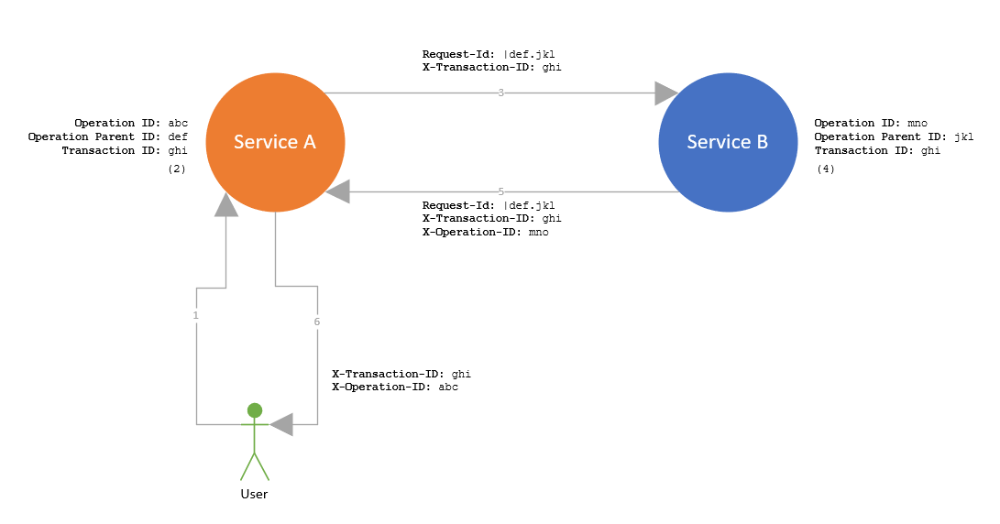

# Automatic HTTP client correlation tracking in Arcus WebAPI v1.6
Arcus WebAPI v1.6 is all about service-to-service correlation. Both sending and receiving sides are updated with cool features to ease the complexity of HTTP correlation.

## Automatic tracking correlated HTTP requests
Arcus WebAPI already contained the necessary middleware components to receive and parse the HTTP correlation from incoming requests and use it throughout the application. The `Request-Id` and `X-Transaction-ID` request headers are used to determine by what ID the parent of this request (sender) is identifying itself (`Request-Id`) and by what ID this whole HTTP interaction should be identified (`X-Transaction-ID`). This will eventually result in an HTTP correlation model that is accessible anywhere in the application. What v1.6 adds, is how we send and track such a correlated HTTP request.

To put things in perspective, here is a diagram of such interactions. In this example, the user interacts with service A which calls service B to answer the client's request. 


This diagram shows a fully correlated HTTP interaction. For a more in-depth explanation, see [our official documentation page](https://webapi.arcus-azure.net/features/correlation) to understand each step of the interaction. Right now, we are only going to focus on the third interaction arrow, which is how service A can contact service B with automatic HTTP correlation and tracking.

### HTTP message handler registration
Sending HTTP requests in a .NET application with a dependency injection system usually happens via the built-in [HTTP client factory](https://docs.microsoft.com/en-us/aspnet/core/fundamentals/http-requests). With a simple call to `services.AddHttpClient()` will make sure that there is a `HttpClient` available in your application. The added value of using injected clients is that additional configuration, authentication, etc. only has to be set up once and is centralized in the application. The HTTP client can be extended with your configuration and authentication by using the [composable HTTP message handlers](https://docs.microsoft.com/en-us/aspnet/core/fundamentals/http-requests#outgoing-request-middleware). That is why we added an HTTP message handler that does the correlation and tracking for you.

To make sure that all the injected HTTP clients will add correlation to their request, the following additions have to be made:
```csharp
using Microsoft.AspNetCore.Builder;

WebApplication builder = WebApplication.CreateBuilder();

// Register the HTTP correlation services which makes sure that the correlation is available throughout the application.
builder.Services.AddHttpCorrelation();

// Register the HTTP message handler that enriches the HTTP request with the application's correlation.
builder.Services.AddHttpClient("from-service-a-to-service-b")
                .WithHttpCorrelationTracking();

WebApplication app = builder.Build();

// Register the HTTP middleware component that sets the application HTTP correlation based on the incoming request.
app.UseHttpCorrelation();
```

Now, what happens when the injected `HttpClient` is used with this additional HTTP message handler? Internally, two things happen: first, the available HTTP correlation in the application will be used to enrich the outgoing HTTP request with the necessary correlation headers. As shown in the diagram, the request will have two headers: `Request-Id` and `X-Transaction-ID`. Second, the request will be tracked as an HTTP dependency and will be available as such if Application Insights is configured.

The complexity of HTTP correlation is hard to explain and even harder to get right in your application. That is why we have chosen to use this approach as it hides all the infrastructure from your application code so that consumers only have to focus on the request's contents.

## HTTP client extensions
Not all applications can use the built-in HTTP client factory. Certain scenarios require you to send a correlated HTTP request outside the boundaries of an API. In any case, there are many places where the previous approach would not work. In those cases, we have made sure that consumers can still benefit from an easier way of sending and tracking correlated HTTP requests.

Starting from v1.6, the library has several extensions on the `HttpClient.SendAsync` method that takes in all the necessary information that would otherwise be extracted from a dependency injection system. Two things are required: access to the application's correlation model (`CorrelationInfo`), and a logger instance. Internally, the same things happen as with the HTTP message handler, which is reflected in the required parameters that the extension takes in.
```csharp
using System.Net.Http;
using Microsoft.Extensions.DependencyInjection;
using Arcus.WebApi.Logging.Core.Correlation;

var client = new HttpClient();

// Current application's correlation.
var correlation = new CorrelationInfo("operation ID", "transaction ID");

// Application's logger.
ILogger logger = ...;

var request = new HttpRequestMessage(HttpMethod.Get, "https://localhost/service-b");
await client.SendAsync(request, correlation, logger);
```

Both the HTTP message handler and the HTTP client extensions are configurable. Which request headers should be used for the HTTP correlation, how the HTTP dependency will be logged, it is all made configurable for your needs. See our [official feature documentation](https://webapi.arcus-azure.net/features/correlation) for more information on both approaches and how to use them in your application. 

## Bonus: open exception handling middleware
Arcus WebAPI v1.6 focuses mostly on finishing the service-to-service correlation features. Though, we have a small but useful bonus feature in this release.

Exception handling via middleware is one of the oldest features in this library. The purpose and implementation are straightforward: manage unhandled exceptions. The component makes sure that any uncaught exceptions are handled and logged, whilst returning an HTTP failure code to the client.

However, the HTTP failure code was static for exceptions that the middleware component didn't recognize, which means that different custom application failures that rely on exceptions all resulted in the same general HTTP failure code (which was `500 InternalServerError`). In some scenarios, this is not enough and is obscure for the client.

v1.6 changed this by opening up the internal structure and letting the consumer decide how a certain type of exception affects the returned HTTP response.
Following example shows how each type of exception can have its HTTP failure code:
```csharp
using Arcus.WebApi.Logging;
using Microsoft.AspNetCore.Http;
using Microsoft.Extensions.Logging;

public class MyExceptionHandlingMiddleware : ExceptionHandlingMiddleware
{
    public MyExceptionHandlingMiddleware(RequestDelegate next) : base(next)
    {
    }

    protected override void LogException(ILogger logger, Exception exception)
    {
        logger.LogCritical(exception, "Custom exception handling!");
    }

    protected override void WriteFailureToResponse(Exception exception, HttpStatusCode defaultFailureStatusCode, HttpContext context)
    {
        if (exception is ValidationException)
        {
            context.Response.StatusCode = (int) HttpStatusCode.BadRequest;
        }
        else if (exception is TimeoutException)
        {
            context.Response.StatusCode = (int) HttpStatusCode.ServerTimeout;
        }
        else 
        {
            context.Response.StatusCode = (int) defaultFailureStatusCode;
        }
    }
}
```

Notice that the middleware component is now also letting the consumer decide how the caught exception is logged. 
We have made sure that the default HTTP failure code is passed along as we internally also catch the `BadHttpRequestException`, which will result in `400 BadRequest` as default status code. In all other cases, we still use the `500 InternalServerError` as default.

Registering your custom middleware component happens with an overload of the general exception handling middleware:
```csharp
using Microsoft.AspNetCore.Builder;

WebApplicationBuilder builder = WebApplication.CreateBuilder();
WebApplication app = builder.Build();

app.UseExceptionHandling<MyExceptionHandlingMiddleware>();
```

This feature is small but makes our provided functionality more customizable and useful in your application, which is what Arcus is all about.

## Conclusion
Service-to-service correlation is a big and complex topic that spans multiple Arcus repositories. In this post, we have explained only a small piece of the correlation puzzle. Expect a more in-depth user guide on how to integrate service-to-service correlation in your application soon.

Arcus WebAPI v1.6 has also many internal improvements that were too vast to explain here. Upgrade to this version to experience all these cool new changes in your application. See [our feature documentation](https://webapi.arcus-azure.net/) to explore what we have to offer. 

If you have any questions, remarks, comments, or just want to discuss something with us; feel free to [contact the Arcus team at Codit](https://github.com/arcus-azure/arcus.webapi/issues/new/choose).

Thanks for reading!
The Arcus team