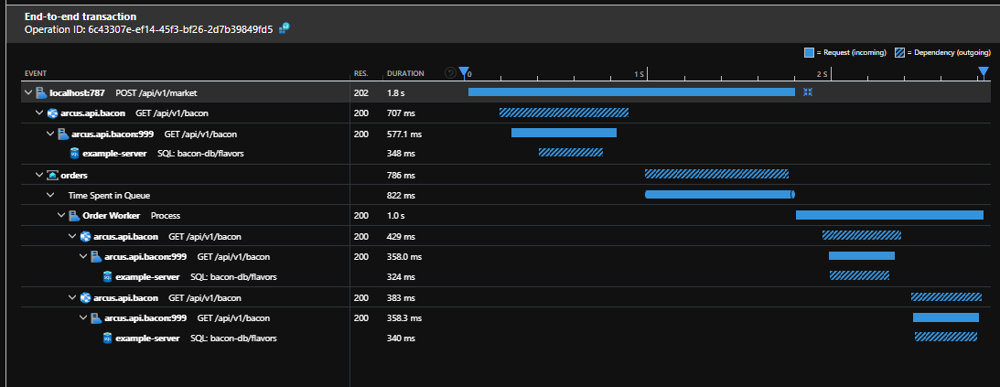

# Service-to-service correlation, one of the biggest Arcus features in Observability v2.5
Arcus Observability v2.5 marks a new era in telemetry and correlation functionality. The service-to-service correlation is finally here! Let's take a look at the latest changes on this topic and any other additions present in this release.

## Service-to-service correlation
This topic is so big that it deserves its own blog post(s) - which we will provide in the future. For now, let's take look at this from a very simple perspective: for better telemetry tracking around single or multiple applications, the logged information should be linked together. Why? Because it will help track down failures, pinpoint performance bottlenecks, keep track of the scope of your application and its dependencies and so on.

To do this linking, we need to pass around ID's that link sent/received messages together. One of these ID's is called "dependency ID's".

### Dependency ID's
Dependency ID's are unique identifiers that represent an operation between the called dependency and the received request on that dependency. From the sender's point of view, this is called the dependency ID; from the receiver's point of view, this is called the parent ID. That way, the telemetry that tracks the request (receiver) knows that its parent was the tracked dependency (sender).

The Observability library provides all sorts of dependency types that can be tracked, but not all of them supported dependency ID's in their signatures. Starting from v2.5, all dependency types can be tracked with dependency ID's.

```csharp
using Arcus.Observability.Telemetry.Core;

using (var measurement = DurationMeasurement.Start())
{
    var dependencyId = "abc";
    var endpoint = "https://my-custom-http-endpont/";
    var request = new HttpRequestMessage(endpoint);

    try
    {
        await HttpClient.SendAsync(request);
    }
    finally
    {
        logger.LogHttpDependency(
          request, 
          statusCode: response.StatusCode, 
          measurement: measurement,
          dependencyId: dependencyId);

       // Output: {"DependencyType" "Http", "DependencyId": "abc", "DependencyName": "POST /r/ujxglouj", "TargetName": "requestbin.net", "ResultCode": 200, "Duration": "00:00:00.2521801", "StartTime": "03/23/2020 09:56:31 +00:00", "IsSuccessful": true, "Context": {}}

    }
}
```

### Request linking
Incoming HTTP calls, retrieved messages on an Azure Service Bus queue, any incoming message should be tracked as a telemetry request in Application Insights. Previously, we tracked dependencies the same way as requests which made parent/child linking hard as the request is in this case always the parent of the dependency. In v2.5 we made sure that requests are tracked differently so that the linking between the two is done automatically without any intervention needed from the developer.

Looking at the result of this new feature and the tedious complexity that is hidden behind seamless simplicity, it is amazingly beautiful. An example of request linking is shown below:


Don't worry, the service-to-service correlation feature will be explained more in-depth in later phases so you can integrate it without effort in your application. For now, enjoy the prospect of beautiful request linking. 

## Future proof Application Insights connection string support
Soon, Application Insights will [stop supporting instrumentation keys](https://azure.microsoft.com/en-us/updates/technical-support-for-instrumentation-key-based-global-ingestion-in-application-insights-will-end-on-31-march-2025/) and fully rely on connection strings to track telemetry. Instead of waiting until the last months, we already made sure that we can support connection strings. The feature documentation and code also reflect this to gently guide users to use connection strings instead of instrumentation keys.

We have added a couple of new extensions to make this explicit:
```csharp
using Serilog;
using Serilog.Configuration;

ILogger logger = new LoggerConfiguration()
    .MinimumLevel.Debug()
    .WriteTo.AzureApplicationInsightsWithConnectionString("<connection-string>")
    .CreateLogger();

ILogger logger = new LoggerConfiguration()
    .MinimumLevel.Debug()
    .WriteTo.AzureApplicationInsightsWithInstrumentationKey("<key>")
    .CreateLogger();
```

## SQL-pseudo command for more realistic SQL dependency tracking
Tracking SQL dependencies is already a long available feature in Arcus Observability. In v2.5, though, we made sure that tracking said dependencies is more in line with realistic SQL scenarios. The problem was that we asked for a single table name while realistic interactions with SQL Servers often happen across multiple tables (like `JOIN`). So, we made sure that consumers now can pass in a pseudo-like SQL command that will be passed to the dependency tracking. This pseudo-command will make sure that the dependency telemetry on Application Insights is more distinguished from other SQL tracking. Administrators also will have an idea of the underlying low-level interaction with the SQL dependency, without knowing the fine-grained details.

```csharp
using Microsoft.Extensions.Logging;
using Arcus.Observability.Telemetry.Core;

using (var measurement = DurationMeasurement.Start())
{
    try
    {
        // Interact with database
        string[] productNames = await _repository.GetProductNames();
    }
    finally
    {
        logger.LogSqlDependency("sample-server", "sample-database", "SELECT Name FROM Products", isSuccessful: true, startTime: startTime, duration: durationMeasurement.Elapsed);
        // Output: {"DependencyType": "Sql", "DependencyName": "sample-database", "DependencyData": "SELECT Name FROM Products", "TargetName": "sample-server", "Duration": "00:00:01.2396312", "StartTime": "03/23/2020 09:32:02 +00:00", "IsSuccessful": true, "Context": {}}
    }
}
```

## Conclusion
Observability v2.5 is quite big. Not only have we taken significant steps in the service-to-service correlation story, but also made Observability more production-ready and future-proof. Stay tuned for more information on the service-to-service correlation feature, which is probably the biggest cross-repository Arcus feature we have ever created.

See [our official documentation](https://observability.arcus-azure.net/) for more information on all the currently supported features.
If you have any questions, remarks, comments, or just want to discuss something with us; feel free to [contact us](https://github.com/arcus-azure/arcus.observability/issues/new/choose).

Thanks for reading!
-Arcus team