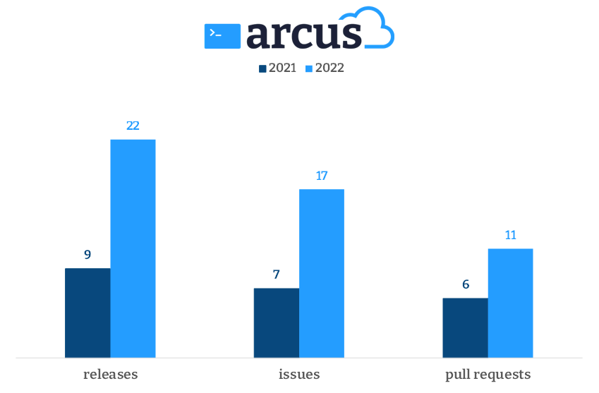

# 2022, the year that Arcus put on grown-up pants
Arcus has never grown in releases as much as in 2022. Come and see this post on the biggest changes on the Arcus front. It is time to put on grown-up pants.

Arcus has grown on all fronts this year. Not only has it 22 releases, but it also received 17 issues from 10 external contributors and 11 pull requests from 6 external members. This is a very nice number and a great improvement from last year.

We tried this year to place Arcus more in the spotlight. Releasing more frequently is one of the ways we did that. In those 22 releases are some smaller ones but each has much added value and provides real production value for your project. A higher release rate also means that we can respond to certain problems more quickly. We are seeing Arcus being adapted and invested in, which results in more issues and pull requests. More and more, Arcus receives the recognition it deserves.

## Service-to-service correlation
Correlation was a hot topic this year. Service-to-service correlation was a feature that was striving for and that we not only implemented across all Arcus repositories but even have improved upon. The deprecated hierarchical correlation system was implemented in the first round but currently, we are already moving toward the new W3C correlation system. This new system allows us to interact more with Microsoft functionality like automatically tracking dependencies that are interacted with Microsoft technology (Azure SDK, HTTP, SQL). Having automatic dependency tracking is a big selling point for Arcus as it builds upon existing Microsoft functionality without the need for the consumer to move away from its features. In essence, that is what Arcus is all about: improving existing technology.

🚩 [More info on Arcus HTTP correlation](https://webapi.arcus-azure.net/features/correlation/) 

## Secret management
The Arcus secret store is a great Arcus feature that lets you store secrets more safely in a dedicated store with a single interaction point instead of being scattered in the already populated application configuration. This highly-extensible feature is one of the oldest features in our repertoire and just got more amazing this year.

Versioned and synchronous secrets were added to the Arcus secret store this year. Secret versions allow you to store multiple versions of a single secret in your registered secret providers. Synchronous secrets let you retrieve your secret in a synchronous manner instead of the built-in supported asynchronous way. Both are big changes internally but rather small outward changes. Both were grown from consumer interaction with the secret store, making this great feature all the more greater.

🚩 [More info on Arcus secret store](https://security.arcus-azure.net/features/secret-store)

## Rebranding everything Arcus
You might already have noticed the new logo in the statistics diagram. Arcus has received a whole new makeover that makes it a more trendy development tool, and hopefully, helps us spread the word of Arcus. We are moving all the Arcus feature documentation pages to this new style and are also rebranding the general Arcus site. It will contain lots more information on the 'Why/How to use Arcus?' which is one of the most-asked questions we receive. We have also added some user guides that show step-by-step how a certain Arcus functionality can be implemented in your application.

🚩 [Keep an eye on the upcoming new site](https://arcus-azure.net/)

## .NET 6 for all
.NET Core will be deprecated at the end of this year. Therefore, we have made it our commitment to add .NET 6 support to all Arcus libraries - while still supporting .NET Core. This is a good example of how we used small releases with big impact. .NET 6 was a big requested feature, and we have learned quite a bit about cross-repository changes and to do this even more smoothly for .NET 8 and beyond (We are mostly supporting LTS).

## Conclusion
Arcus took a huge step towards maturity in 2022. We have released lots of new and enhanced functionality, updated our feature documentation with user guides and other helpful descriptions, and rebranded everything related to Arcus.

This list is by far not complete. There are a lot of technical updates on our repositories that can be looked over in more detail. For more information on our available repositories, see [our general Arcus site](https://arcus-azure.net/).

2023 will be a year where we will further enhance Arcus to be the best tool it possibly can. These are some of the open tasks we will be working on:
- IoT Edge module templates in Arcus Templates
- Bicep template support in Arcus Scripting
- Fully support W3C correlation and provide the necessary user guides
- And lots more...

As always, thanks for reading and if you have any ideas, issues, problems, or just want to discuss something, don't hesitate to take a look at any of our [Arcus repositories](https://github.com/arcus-azure).
We are happy to have you.

Thanks for reading!
- Arcus team