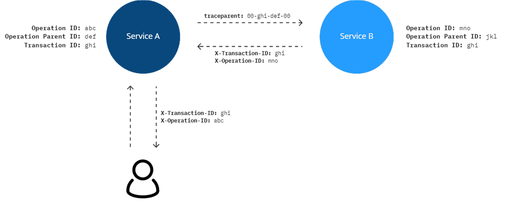

# W3C service-to-service correlation in newest Arcus releases
One of the biggest changes in the recent Arcus releases is the W3C correlation support on all of our components. Read further to learn how it can improve your application.

## What has changed?
The service-to-service correlation feature was already supported before we looked into W3C. Service-to-service correlation provides a way to link all the send-out telemetry of your application's services into a single transaction diagram. This helps pinpoint the cause of service failures, performance bottlenecks, and gives you a clear overview of all the resources your project uses. In Azure Application Insights, this translates to [transaction diagnostics](https://learn.microsoft.com/en-us/azure/azure-monitor/app/transaction-diagnostics) and an [application map](https://learn.microsoft.com/en-us/azure/azure-monitor/app/app-map?tabs=net).

So, what has changed? Previously, we were using [hierarchical](https://github.com/dotnet/runtime/blob/main/src/libraries/System.Diagnostics.DiagnosticSource/src/HierarchicalRequestId.md) correlation, which uses `Request-Id` to establish a link between 'parent' (sender) and 'child' (receiver). This ID could be sent via an HTTP header or an Azure Service Bus application property or any other system that has a sender/receiver relationship. There were two problems with this approach, 1. the hierarchical correlation system is deprecated, and 2. it is not Microsoft's default correlation format. This made us switch to the W3C correlation system. The biggest changes are internal. Though, this format uses the `traceparent` value instead to pass along sender/receiver services. 



## Migrate from hierarchical to W3C correlation
The W3C update affects three packages. Make sure that you update to at least these versions: [Arcus Web API v1.7](https://webapi.arcus-azure.net/), [Arcus Messaging v1.4](https://messaging.arcus-azure.net/), and [Arcus Observability v2.7](https://observability.arcus-azure.net/).

🚩 Note that you do not need a Messaging package in an API application or the way around. These are just the minimum versions you'll need in any one of your applications using Arcus.

Now comes the fun part. All you have to do in any of your applications to have seamless integration with Microsoft is add/change these lines in your `Program`:
```diff
using Arcus.Security.Core;
using Microsoft.Extensions.DependencyInjection;
using Microsoft.Extensions.Hosting;
using Serilog;
using Serilog.Configuration;

public class Program
{
    public void ConfigureServices(IServiceCollection services)
    {
+       services.AddAppName("Your Application Name");
+       services.AddAssemblyAppVersion<Program>();
    }

    public async Task ConfigureSerilogAsync(IHost app)
    {
        var secretProvider = host.Services.GetRequiredService<ISecretProvider>();
        string connectionString = await secretProvider.GetRawSecretAsync("APPLICATIONINSIGHTS_CONNECTION_STRING");
        
        var reloadLogger = (ReloadableLogger) Log.Logger;
        reloadLogger.Reload(config =>
        {
            config.MinimumLevel.Information()
                  .MinimumLevel.Override("Microsoft", LogEventLevel.Information)
                  .Enrich.FromLogContext()
-                 .Enrich.WithVersion()
-                 .Enrich.WithComponentName("Your Application Name")
+                 .Enrich.WithVersion(host.Services)
+                 .Enrich.WithComponentName(host.Services)
                  .WriteTo.Console();
            
            if (!string.IsNullOrWhiteSpace(connectionString))
            {
-               config.WriteTo.AzureApplicationInsightsWithConnectionString(connectionString);
+               config.WriteTo.AzureApplicationInsightsWithConnectionString(host.Services, connectionString);
            }
            
            return config;
        });
    }
}
```

⚡ Notice that there are no additional changes required for API, Messaging-specific or event Azure Functions applications. All the critical changes are internal. The modifications described here are just to create a seamless integration with Microsoft technology. Behind the scenes, the `AddAppName`/`Add...AppVersion` will make sure that Microsoft's `TelemetryClient` is configured as appropriate. This same client will be re-used when registering the Serilog sink.

⚠ It's worth noting that these changes need to happen across all your applications as these will now use W3C correlation by default. Not changing them will result in a broken transaction diagram. You can always move back to hierarchical to do this migration in steps. 

## Moving forward
After the packages are upgraded and the small observability changes are added, we can look at the current and future tracked telemetry. Because this new system uses Microsoft's default W3C correlation format, all called dependent services will be tracked automatically. This includes HTTP requests, SQL commands and any Azure services like Azure Service Bus or EventHubs. This means that if you have tracked such service before with Arcus extensions, you can now remove this (otherwise it will be tracked twice). 

```diff
- HttpStatusCode statusCode;
- using (var measurement = DurationMeasurement.Start())
- {
-     try
-     {
          using (HttpResponseMessage response = await HttpClient.SendAsync(request))
          {
-              statusCode = response.StatusCode;
          }
-     }
-     finally
-     {
-         Logger.LogHttpDependency(request, statusCode, measurement);
-     }
- }
```

This will greatly reduce the observability clutter in your application.

⚡ Since this new update also builds on top of existing Application Insights services, you can inject the `TelemetryClient` into your application if you want to do some advanced telemetry tracking. Since the Serilog sink reuses this client, any [additional advanced configuration](https://learn.microsoft.com/en-us/azure/azure-monitor/app/api-filtering-sampling) will also affect the telemetry sent via the regular [Arcus telemetry](https://observability.arcus-azure.net/features/writing-different-telemetry-types/).

Future dependent services that are not one of Microsoft's resources can still be easily tracked with Arcus telemetry. All other technology will be tracked automatically.

💡 All the [Arcus project templates](https://templates.arcus-azure.net/) will be adapted to this new way of working so that new projects can also benefit from this behavior.

## Conclusion
What's great about this update, is that it does not break current behavior but only extends it with automatic dependency tracking via the Application Insights services. There were some arguments to still use the Application Insights SDK instead of our Arcus Serilog sink setup, but this new update renders this difference mute. They now work together.

📢 To learn more about W3C service-to-service correlation, see our extensive [user guides](https://observability.arcus-azure.net/Guidance/Service-to-service%20Correlation/index) where we explain step-by-step how an application without tracking can be adapted to fully leverage the power of Arcus and Microsoft telemetry.

See [our official Observability documentation](https://observability.arcus-azure.net/) for more information on all the currently supported features.
If you have any questions, remarks, comments, or just want to discuss something with us; feel free to [contact us](https://github.com/arcus-azure/arcus.observability/issues/new/choose).

Thanks for reading!
The Arcus team