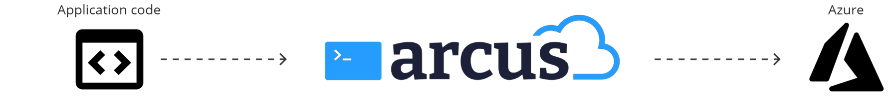
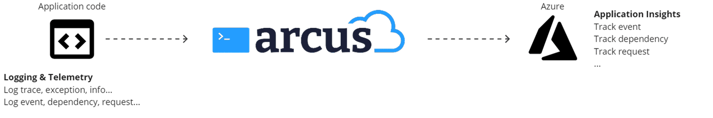
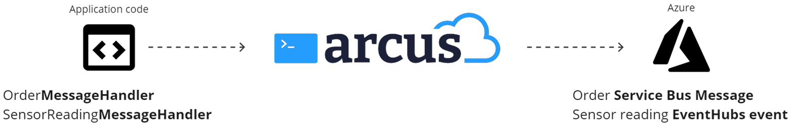

# How to use Arcus?
Arcus' main goal is to make your application development more efficient. This includes infrastructure or boilerplate code that is almost exactly the same on every project. You can see Arcus as the middleware between your business application code and Azure components.

Focusing on application code as much as possible, that's where Arcus comes in.

## How to use Arcus Observability
The observability library provides the solution to a single point of truth for your logging and telemetry. The library simplifies logging by abstracting the Azure Application Insights telemetry behind the default Microsoft logging abstraction. Writing traces or informational messages becomes as simple as tracking a dependency to Application Insights.

We use Serilog as our main logging system as Microsoft also favorites this library. How this works is: Arcus registers a Serilog sink that writes telemetry to Application Insights. Writing logging messages or telemetry now all happens with the injected `ILogger` instances in your application. With custom extension on the logger like `LogEvent`, `LogDependency`... one can control the telemetry via the logging system itself.

For more information on observability, see [our official documentation page](https://observability.arcus-azure.net/).

### Q: Why not use the Microsoft package for telemetry?
- **Decoupling**: telemetry is much more than only a trace or informational message. Usually, it's about contextual information and additional correlation and other enrichment information. In an application without Arcus Observability, logging and telemetry are separated as one need both a `ILogger` and `ITelemetryClient`. Arcus decouples telemetry from your application so all interactions goes via the injected `ILogger`, making telemetry in your application much simpler.
- **Simplicity**: correlation, service-to-service correlation, duration measurement, dependency tracking, versioning, etc. There is a lot of infrastructural information that makes your telemetry useful. The linkage between components is a very hard subject to get right in your application. Arcus simplifies this by using the same infrastructure in all its components, making telemetry ready out-of-the-box. Our Web API, Messaging, EventGrid libraries all use the same dependency and request tracking so you don't have to worry about these internal workings but can focus on the resulting application telemetry shown in Application Insights.

## How to use Arcus Security
The security library provides the solution to a single point of truth for your secret management. Arcus makes sure that there's a difference between configuration data values and private secrets within your application. Without Arcus, these are not always clearly defined and are even sometimes stored in the `IConfiguration` of the application.

The Arcus secret store abstracts the secret retrieval into a system very similar how the application configuration is set up: multiple 'sources' can be configured from where the secrets can be retrieved. The popular location here is Azure Key Vault, but we support many different other secret sources. You can even create your own secret source to retrieve your secrets.

All these secret sources are combined into a single 'secret store' which can be accessed anywhere in your application.
For more information on security, see [our official documentation page](https://security.arcus-azure.net/).

### Q: Why not use the Microsoft package for Azure Key Vault?
- **Decoupling**: the Arcus secret store decouples the use of Key Vault from your application with a simpler API interface to get your secrets. This decoupling allows other sources as well. If an application requires multiple Azure Key Vaults, then it would have to delegate itself between the two while the Arcus secret store does this delegation for you by decoupling the secret source (Azure Key Vault) from the actual application code that requires the secret.
- **Simplicity**: because it's decoupled, many different secret sources are allowed. In development, one can choose to place the secrets in a local configuration file but you still want to use Azure Key Vault in production. The Arcus secret store allows you to register both without any changes in your actual application code that uses the secret. The decoupling makes your application code much simpler. Without the secret store, you would need to extract the configuration value yourself and all the while handle your Azure Key Vault interaction too, while the Arcus secret store hides this complexity behind a simple 'Get secret' interface.

## How to use Arcus Messaging
The messaging library provides a solution for easier message routing/handling upon receiving messages from a queue. Usually, there is some message routing happening based on, for example, the message context or application properties. "Message of type Order, gets processed by the Order handler", "Message with property 'Shipment=Boat', gets processed by BoatShipmentHandler", and so on. This way of message routing is so common in messaging scenario's that Arcus provided a simple way to do this message routing the same way in all applications.

As a developer, you only have to create your different message handlers based on the type of messages you receive from your messaging system. Currently, we only support Azure Service Bus topics and queues.
When a message comes on the queue, it gets routed via Arcus to the correct message handler you configured. Within your message handler, you will be able access any other registered application services to further process the message.

For more information on messaging, see [our official documentation page](https://messaging.arcus-azure.net/).

### Q: Why not use Microsoft package for Azure Service Bus?
- **Decoupling**: the messaging library provides for you a decoupling from the message source (Azure Service Bus) and the message handling. Because it is decoupled, the exact same message handling functionality can also be re-used across message pumps, Azure Functions, etc. without ever changing the application code. 
- **Simplicity**: Without the messaging library you would not only have your own message routing set up, but also have to worry about usability across different components, while the messaging library only required you to implement the message handling.

## How to use Arcus Templates
The templates library provides a way to scaffold infrastructure code on the start of new projects. We provide several project templates which already include the Arcus secret store, the observability telemetry, messaging code with sample message handlers, and many more.

This way, you don't have to figure out afterwards how some piece of functionality is called but can start code your application code right away.

## How to use Arcus Scripting
The scripting library provides a collection of frequently-used PowerShell commands in a clean module-categorized manner. These scripts are the results of many used commands that are now maintained by Arcus and can be easily used during your DevOps or Azure management work. 
