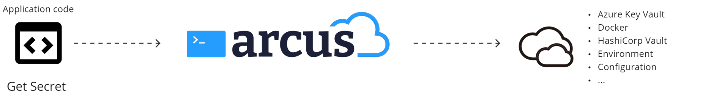

# How to use Arcus?
Arcus' main goal is to make your application development more efficient. This includes infrastructure or boilerplate code that is almost exactly the same on every project. You can see Arcus as the middleware between your business application code and Azure components.

Focusing on application code as much as possible, that's where Arcus comes in.

## How to use Arcus Observability
The observability library provides the solution to a single point of truth for your logging and telemetry. The library simplifies logging by abstracting the Azure Application Insights telemetry behind the default Microsoft logging abstraction. Writing traces or informational messages becomes as simple as tracking a dependency to Application Insights.

We use Serilog as our main logging system as Microsoft also favorites this library. How this works is: Arcus registers a Serilog sink that writes telemetry to Application Insights. Writing logging messages or telemetry now all happens with the injected `ILogger` instances in your application. With custom extension on the logger like `LogEvent`, `LogDependency`... one can control the telemetry via the logging system itself.

For more information on observability, see [our official documentation page]().

## How to use Arcus Security
The security library provides the solution to a single point of truth for your secret management. Arcus makes sure that there's a difference between configuration data values and private secrets within your application. Without Arcus, these are not always clearly defined and are even sometimes stored in the `IConfiguration` of the application.

The Arcus secret store abstracts the secret retrieval into a system very similar how the application configuration is set up: multiple 'sources' can be configured from where the secrets can be retrieved. The popular location here is Azure Key Vault, but we support many different other secret sources. You can even create your own secret source to retrieve your secrets.

All these secret sources are combined into a single 'secret store' which can be accessed anywhere in your application.
For more information on security, see [our official documentation page]().

## How to use Arcus Messaging
The messaging library provides a solution for easier message routing/handling upon receiving messages from a queue. Usually, there is some message routing happening based on, for example, the message context or application properties. "Message of type Order, gets processed by the Order handler", "Message with property 'Shipment=Boat', gets processed by BoatShipmentHandler", and so on. This way of message routing is so common in messaging scenario's that Arcus provided a simple way to do this message routing the same way in all applications.

As a developer, you only have to create your different message handlers based on the type of messages you receive from your messaging system. Currently, we only support Azure Service Bus topics and queues.
When a message comes on the queue, it gets routed via Arcus to the correct message handler you configured. Within your message handler, you will be able access any other registered application services to further process the message.

For more information on messaging, see [our official documentation page]().

## How to use Arcus Templates
The templates library provides a way to scaffold infrastructure code on the start of new projects. We provide several project templates which already include the Arcus secret store, the observability telemetry, messaging code with sample message handlers, and many more.

This way, you don't have to figure out afterwards how some piece of functionality is called but can start code your application code right away.

## How to use Arcus Scripting
The scripting library provides a collection of frequently-used PowerShell commands in a clean module-categorized manner. These scripts are the results of many used commands that are now maintained by Arcus and can be easily used during your DevOps or Azure management work. 
